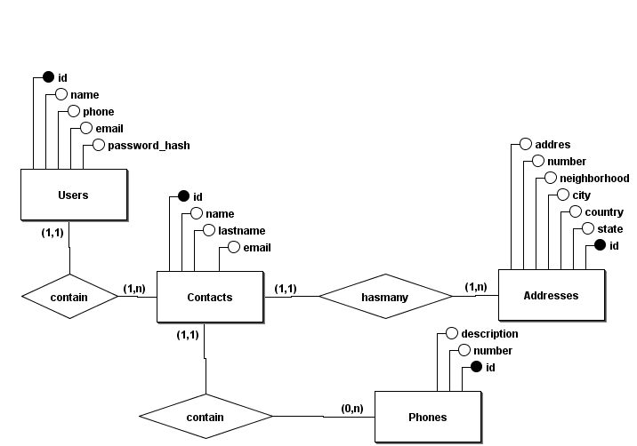
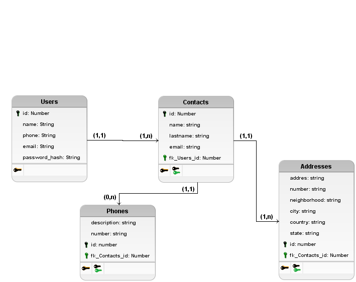
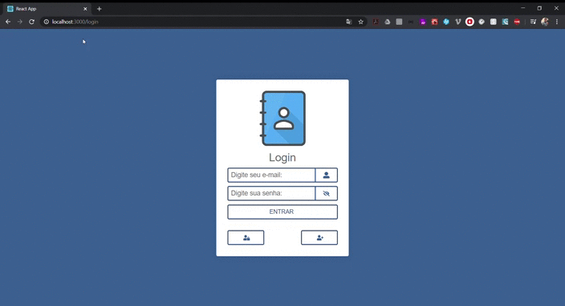

# Populus
## Aplicação de controle de contatos desenvolvido para um teste.
A aplicação consiste com os requisitos de:
* Cadastro de contatos

* Via AJAX

* Via HTML Submit

* Busca de endereço pelo CEP / API dos Correios

* Envio de notificação assíncrona de sucesso (via e-mail, slack ou outro canal a sua escolha)

* Categorização / Agrupamento

* Busca de contatos com sugestão de pesquisa

* Possibilidade de muitos endereços e telefones por contato

* Autenticação (somente usar após login)

* Responsividade (funcionar desktop e mobile)

* Formulários de cadastro devem possuir validação em front e backend.

* Você pode usar quais tecnologias, modelagem, bibliotecas quiser.

## Modelo conceital de relacionamento desenvolvido a partir da proposta
<br>

<br>

## Modelo Lógico de relacionamento desenvolvido a partir da proposta

<br>



### Backend
<br>
Backend consiste nos seguintes serviços oferecidos: cadastro de usuario, em realizar sua sessão (login),  cadastrar,visualizar,editar e excluir seus contatos, bem como seus respectivos telefones e endereços, é notificado por e-mail e alteração de dados delicados como senhas e consiste na utilização do ORM Sequelize em conjunto com Express que trabalham muito bem com o Banco de dados Postgres para armazenamento de dados, Mongo para notificações e o Redis para fila de processos com uma espera longa. para aprimorar e prever erros e uma melhor melhor qualidade foi implementado alguns exemplos de test com Jest e seus relatórios de resultados.

#### Requisitos
<br>
Para iniciar o projeto você deve ter instalado e em execuçaõ de serviços

* Redis (Banco de processos)

* Postgres (Banco de dados - relacional - Banco de dados (populus))

* Mongo (Banco de dados - não-relacional)

* NodeJs v.10.19 

* Yarn

`obs:Você pode utilizar o docker para evitar a instalação destes implementação`

Comando do docker para instalação dos serviços

* 1º - ```docker docker run --name database -e POSTGRES_PASSWORD=102030 -p 5432:5432 -d postgres``` //instalação do servico do postgres

* 2º - ```docker docker run --name mongodatabase -p 27017:27017 -d -t mongo``` //instalação do serviço do mongo

* 3º - ```docker run --name redisqueue -p 6379:6379 -d -t redis:alpine``` //instalação do serviço do redis

#### Iniciar

<br>
Após a instalação de todos os requisitos rode o comando dentro da pasta backend

* yarn

Rode o comando em um terminal de sua preferência

* yarn queue

Rode em conjunto 

* yarn dev

Para teste apenas utilize o - yarn queue e - yarn test

### Frontend
<br>
Frontend consiste nos seguintes serviços: cadastro de usuario, em realizar sua sessão (login),  cadastrar,visualizar,editar e excluir seus contatos, bem como seus respectivos telefones e endereços, para alteração do cadastro nescessario utilização de e-mail, a utilização da arquitetura flux em conjunto com o redux e o sagas, redux para compartilhamento de estados globais na aplicação e o sagas resposavel pelas as regras de negócio e funções assincronas. cores utilizadas em tons claros para melhor vizualização do usuario combinadas com tons escuros, a aplicação é toda responsiva funcionando tanto para web como para mobile para testar utiliza o chrome f12 e selecione a aba de dispositivos móveis.

#### Requisitos
<br>
Para iniciar o projeto você deve ter instalado e processando

* NodeJs

* Aplicação Backend em execução 

* Yarn

#### Iniciar
<br>
Após a instalação de todos os requisitos rode o comando dentro da pasta backend

* yarn

Rode o comando em um terminal de sua preferência

* yarn start

## Resultado
<br>

<br>
<br>

<br>